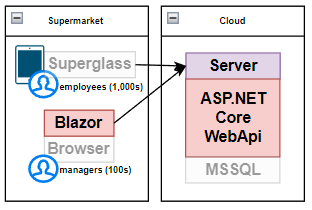
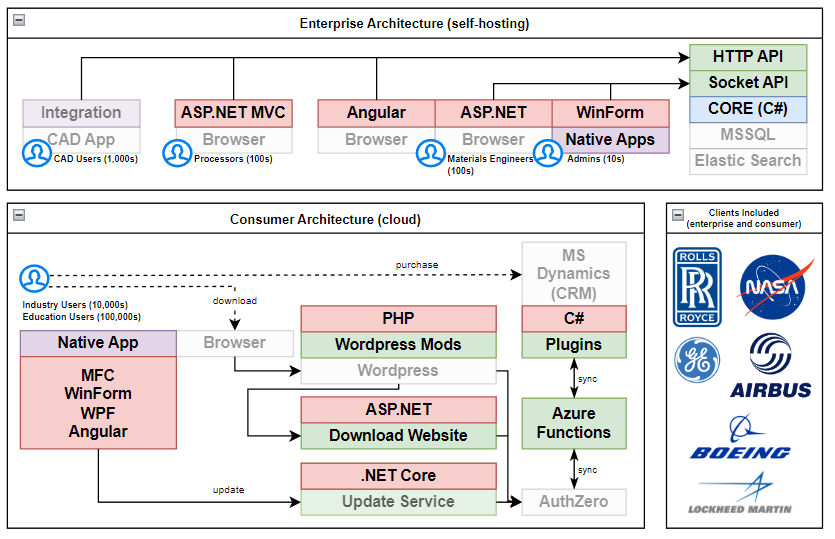
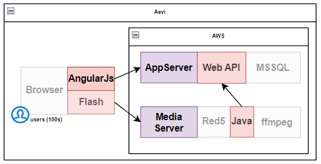
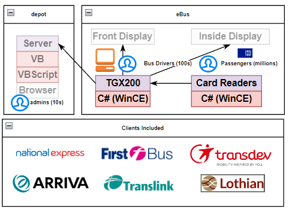
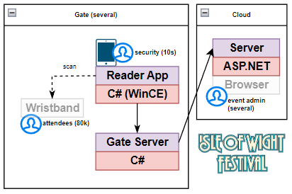

# Simon Potts-Tamman

I am an enthusiastic and accomplished architect, full-stack developer, and consultant with over 20 years of commercial experience in developing software, possessing a deep understanding of each stage of the software lifecycle. This means I am equally comfortable speaking to potential clients during the sales process, debugging multi-threaded code, or configuring build servers. I bring extensive experience across a variety of responsibilities and can seamlessly integrate into any software team, in virtually any role, and hit the ground running.  
I am adept at working independently, collaborating in small to mid-sized teams, or navigating large corporate hierarchies to get things done.

I have either independently developed or contributed to a broad range of applications, from embedded systems to distributed and high-throughput platforms. I excel in both front-end and back-end development, with a slight preference for back-end work due to my interest in scalability. I have worked with a wide array of technologies and while .NET is a preference, I have no hesitation in throwing myself into the unknown and acquiring new skills to deliver results.

I am a strong advocate for defining best practices and striving for their consistent application across an organisation. However, I am experienced enough to recognise that such ideals require consensus to succeed, and sometimes pragmatism is the more appropriate choice. 
I have an amiable character and outside of crafting self-aggrandising statements for my CV; I am low ego.

I bring considerable mentoring experience and have taught friends to develop software from scratch who now work professionally in the field. I have a unique talent for translating “complex” into “simple” and “boring” into “fun,” thanks to my empathic, cheerful, and humourous disposition.

### Technical Skills

| *Technology*         | *Competence*    |
|----------------------|-----------------|
| C#                   | Expert          |
| .NET / Core          | Expert          |
| ASP.NET / Core / MVC | Expert          |
| Web API / Rest       | Expert          |
| SQL                  | Expert          |
| Entity Framework     | Expert          |
| Multi-threading      | Expert          |
| MSBuild              | Expert          |
| WinForm              | Expert          |
| Compact Framework    | Expert          |
| Angular              | Advanced        |
| Typescript           | Advanced        |
| Javascript           | Advanced        |
| OIDC                 | Advanced        |
| Azure                | Advanced        |
| NGinx                | Advanced        |
| Git                  | Advanced        |
| Wix                  | Advanced        |
| NHibernate           | Advanced        |
| WCF                  | Advanced        |
| .NET Remoting        | Advanced        |
| Blazor               | Good            |
| WPF                  | Good            |
| RabbitMQ             | Good            |
| XSLT                 | Good            |
| YARP                 | Good            |
| ServiceBus           | Good            |
| Powershell           | Good            |
| ffmpeg/avconv        | Passable        |
| Java                 | Passable        |
| Python               | Passable        |
| C                    | Passable        |
| C++                  | Passable        |
| LISP                 | Passable        |
| PHP                  | Passable        |
| Delphi               | Passable        |
| Lua                  | Passable        |
| VB / VBA / VB.NET    | I will complain |

### Soft skills

| *Skill*                  | *Competence* |
|--------------------------|--------------|
| Communication            | Expert       |
| Architecture             | Expert       |
| Continuous Integration   | Expert       |
| Project Management       | Expert       |
| Release Management       | Expert       |
| Mentoring                | Expert       |
| eXtreme Programming      | Expert       |
| Testing                  | Expert       |
| Technical Specifications | Expert       |
| DevOps                   | Advanced     |
| Security                 | Advanced     |
| Performance              | Advanced     |
| Agile / Scrum            | Advanced     |
| High Scalability         | Advanced     |
| Cloud Platforms          | Advanced     |
| Requirements             | Advanced     |
| Management               | Good         |
| Outsourcing              | Good         |

### Employment History

| *Employer*            | *Dates*   |
|-----------------------|-----------|
| Crosberg.de           | 2023-2024 |
| Ansys                 | 2016-2022 |
| Aevi                  | 2012-2014 |
| Diametric Development | 2010-2012 |
| Parkeon               | 2007-2010 |
| Digital Healthcare    | 2006-2006 |
| Vesta Money           | 2003-2005 |

### Technical Work 

#### Freelancing

Working for a few clients specifying and implementing online software systems for supermarkets and healthcare. Full stack, Asp.net core, Azure and Blazor.

This diagram is a system we added into an existing enterprise product for a big German supermarket to ensure they were ready for working time and break regulations that went into effect in 2023. This required writing services that were compatible with Superglass devices through APIs they could call to load configuration and exchange data.

I also consulted for an organisation in the German healthcare sector to define best practices for the org across web APIs and development practices (e.g. unit testing) as well as helping with their OIDC implementation.

#### Ansys

I worked across many different departments in my time there. The only part of the software I didn’t touch was the integration into CAD packages (which is why it has low opacity in the diagram).

My responsibilities in this organisation were extremely broad, from fixing bugs with legacy software, to developing and releasing new features, debugging hard to find problems, a full performance analysis of the enterprise system, architecture proposals, new feature proposals, planning/strategy, continuous integration, issue triage, giving presentations and dev-ops.   
I mentored an incredible intern from Cambridge University who now works at Amazon and onboarded and mentored three new developers who all excelled and have since progressed to senior roles at Ansys. I also mentored an extremely bright developer who had been working on the company’s CRM modifications who had no formal training and had inherited a labyrinthine tangle of software from a previous employee, who also had no formal training.  
I worked across multiple technologies and languages including C#, Typescript, PHP, Java, C++ and various scripting languages.

The enterprise product was extremely abstract which made it particularly challenging to work with. It had a free schema, some highly complex data types, versioning, tree structures, along with four different authentication systems and three different authorization systems (five if you include some bespoke ones). The confluence of these features was incredibly challenging at times. i.e. what should happen if you try to delete a node and purge its full history from a tree, that has a historic leaf inside of it that you are not allowed to see? That is a “bug”, that isn’t a bug, but you might not be able to tell that to the user who reported the bug because it might leak information, as nodes were often organised by the values of material properties.

On the consumer side, one of the more interesting technical deliverables was a content delivery system based on Azure Functions, Auth0, Dynamics CRM and ServiceBus. fronted by a collection of Web APIs, ASP.NET Websites and a heavily modified WordPress deployment.

The most interesting architectural deliverable was a long-term plan to unify materials UX across the Ansys suite of products while also transitioning our enterprise platform into a SaaS architecture.

#### Aevi

A series of websites and online services for the Aevi startup. This was a service that recorded personal messages from people who had critical illnesses or worked in hazardous occupations to be delivered to their loved ones and integrated with Icelandic government services to deliver them, should the author pass on.

I was brought in as the CTO as the project needed technological leadership and piqued my curiosity.
My first job was to take stock of the technology we already had, resolve its crippling security issues and push it to release. My second job was to re-imagine the system as we would want it to be and define new use cases.

I converted the front-end into AngularJs and reworked the existing website into an API that an AngularJs front-end could call. I then added the capability to add video messages using Red5 media server, Java and Flash, using ffmpeg in the back end for transforms.

As we had a lot of engineering to do, I outsourced aspects of our system that were sufficiently distinct and self-contained. To do this I used elance.com (now upwork) and developed an approach that allowed to test the skills of various candidates prior to fully hiring them. As such I managed to identify a few extremely capable individuals who produced some exceptional software that required little integration work.  

#### Parkeon

An enterprise framework for transport companies to schedule, organise, administer, and track their entire operation. The main product I worked on was the new flagship platform: eBus, and its first product, the TGX200 console. The TGX200 was an embedded console for bus drivers to collect data about the bus’s transactions and automatically transfer its audit data to the main server when it pulled up to the depot.  
The eBus framework it was later repurposed to function as a smartcard reader for mid-bus deployment as well as a consolidation point for handheld devices for conductors and in stations for rail travel.

The entire stack was custom, from the hardware to a heavily modified WindowsCE operating system and the application layer on top. This made it quite challenging to troubleshoot issues, as any problem that we experienced could be in our hardware, our modifications to the OS, or our application.

I was the lead developer for the application layer. I was initially responsible for the scriptable user-interface and tamper-proof ticket printing. I then performed almost all the integration work from the various teams to create the product. It was my responsibility to liaise with all the departments to ensure the business expectations were reasonable to meet our deadlines or give sufficient warning to the business, if we were at risk of missing them.  
The project was already a year overdue when I joined and committed the first check-in of code (the previous year’s work had been scrapped), so it was a challenging project that I was keen to avoid turning into a “death march”.

The core problem the company was experiencing was cultural. The previous generation of devices the company had produced had been written in C for the embedded devices and Visual Basic for the back-end servers. This meant that only a few of the developers had fully engaged with .NET and the rest were still using VB/C idioms and practices which resulted in a lot of problems. The use of the singleton pattern was rife, which made code impossible to test.  
To spread the use of Best Practice, I gave presentations, mentored developers and created documents that highlighted Best Practice as well as common pitfalls in moving from C/VB to .NET. I played a key role in architecture meetings and championed the modern practices, such as failing-fast and unit testing.

Another cultural issue was a blame culture between our Apps team and the Operating System team that centred around the APIs the OS team exposed to us. When I arrived, both groups blamed each other for the problems in these areas. To address this issue, I proposed and then created the “Platform Abstraction Layer” (PAL), a library to handle the nuances of calls between the Apps and OS team. This was a diplomatic arrangement disguised as a piece of code that was administered by both the Apps and the OS team. As we both worked on it together, it ensured that important information was exchanged, and implementations had buy-in and approval from both sides. This almost immediately resolved the problems we had and resulted in both parties being happy and the boundary between the Apps and Platform team becoming robust.

Not all my ideas propagated. Sadly, I was unsuccessful in my attempt to push for SQLite as a datastore. Our “database” for our audit file was the transmission file itself: An xml file with an open file handle that was unparsable for 99.9% of its life cycle. Due to power spikes and a cultural disdain for atomicity we had a lot of “corruption issues” as all the xml tags were left unclosed and the poor performance of .NET on WinCE meant that closing the tags and re-opening the file was far too slow to do on a regular basis. To resolve this problem, I had to reinvent the wheel by writing a rudimentary database using a series of text files to give us atomicity. I also re-wrote the service in a functional manner (purity) to create snapshots of application state before writing, to avoid torn reads of active memory.
I then wrote a test suite that simulated an audit lifecycle. This test would then kill the process at arbitrary intervals to ensure that it was impossible for the transaction service to spit out an invalid file. These ran daily as part of our continuous integration.

I am quite proud, that the employee whose only job was to manually fix corrupted xml files from the TGX150 series, never had to fix one on the TGX200 series!

You can see a demo of the device [here](https://www.youtube.com/watch?v=ikVHaCcZ5OQ#t=2m5s).  
While in retrospect it looks quite basic, embedded development prior to android and the iphone was kinda ghastly. It was a considerable effort to get it this "good" and I had to do quite a few slightly mad things (e.g. writing every winform control by hand and conserving the use of each control handle through re-use). 

#### Diametric Development  

This was a consultancy firm I used to run. I designed, implemented, released and supported a relatively wide range of projects, from customising existing business software and a variety of hand-held solutions that connected to backend servers to consolidate data. I produced warehousing solutions for Clarks Shoes International, Wincanton and the NHS, a stock markdown system for Somerfield and a utility for field engineers for Orange Mobile.
My favourite system I created was a security system to address issues with fraudulent wristbands at the previous year’s Isle of Wight festival.  

This project was comprised of three pieces of software. A handheld application to scan wristbands, a local server that exposed an API for the handhelds to call to verify the validity of wristband codes and an online service to merge the data, consolidate it and send the merged data back to the local servers to check for duplicates. There was also a relatively simple website that exposed the statistics to the management running the festival so they could check flows and get running counts of any duplicate codes.

I added this one for fun because it’s probably not a project I’d take on these days but is a shrine to the recklessness of youth. There was no specification, and I had two weeks to design, develop and test it. The entire team was me and my business partner at the time, who was technical but was not a developer. So, it was a solo development project with my partner chiefly responsible for deployment. We both went out to the event to deploy it and at one point I even fixed a UI bug while sitting in a field in the sun, on a laptop. I then created a new installer and travelled to each gate to manually update each device.

What was scary is that you don't get second chances with this kind of software, because you can't properly field test it, so if it doesn't work you can't redeploy a few days later because the festival is then over.
Because of this fear I created a little test framework at home to hammer the server to test the potential load, three days prior to the event starting. This exposed the horror that the max throughput was 72k in 24 hours (3k per hour) when the festival was expecting crowds up to 80k to pass through the gates in just a few hours.
Thankfully, after testing a few approaches with the help of my test framework, I realised that abandoning the “best practice” of data normalisation could increase throughput to 40k per hour.

This is the project that really sparked my interest in high scalability. I find it very interesting how many guardrails and best practices you must abandon to achieve max throughput.

#### Digital Healthcare

Joined an existing team to push the 1.0 release of Clinical Trials IP. Contributed to v2 as well as assisting with release of their established Oculab product.

#### Vesta Money  

A mortgage packaging firm that "helped" people with bad credit remortgage their properties in order to reduce their monthly payments.
I mostly wrote software to help record information about customers and show them which mortgages they qualified for as well as various backend processes. 
I was the technical project manager for ensuring the company's compliance new regulations that came into force in late 2004 in the UK and developed software to handle each new requirement we had, as well as patch together any gaps in existing software products we had.
I developed VestaQuote to replace the mortgage quoting product Trigold that we were previously using that didn't take all of the information into account correctly and this resulted in a huge drop of the deals that fell through at the last minute. 
